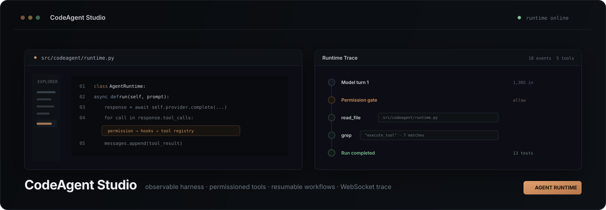

<p align="center">
  
</p>

<p align="center">
  <strong>An observable coding-agent runtime with a desktop-style Web IDE.</strong><br/>
  One agent loop, one execution gate, and a first-class trace for every model turn, tool call, permission decision, workflow step, and completion goal.
</p>

<p align="center">
  <a href="https://github.com/duyuanhong/CodeAgent-Studio/actions/workflows/ci.yml"></a>
  
  
  
</p>

---

## What is CodeAgent Studio?

CodeAgent Studio is a compact, inspectable implementation of a modern coding-agent harness. The model can inspect a repository, search code, edit files, execute commands, spawn subagents, coordinate tasks, connect MCP tools, run resumable workflows, and continue working until an explicit completion goal is satisfied.

The Web IDE exposes the runtime instead of hiding it behind a chat surface. Repository state, terminal output, tool execution, permissions, sessions, worktrees, task graphs, workflows, and runtime events live in the same workspace.

```text
User prompt
    │
    ▼
Context Manager ─────► Model Provider
                          │
                    tool calls?
                     │       │
                    yes      no
                     │       │
                     ▼       ▼
             Permission +   Goal gate
                 Hooks       │
                     │       ▼
                     ▼      Final
               Tool Registry
                     │
                     ▼
                tool_result
                     │
                     └────────────► same agent loop
```

## Why it is built this way

Most agent demos stop at `model -> tool -> model`. CodeAgent Studio keeps that loop deliberately small and moves production concerns around it:

- **Central execution gate**: built-in tools, workflow tool steps, background jobs, and MCP proxy tools share permission checks and lifecycle hooks.
- **Observable runtime**: the `EventBus` emits ordered model, tool, permission, context, background, goal, and final-answer events; the Web IDE streams them over WebSocket.
- **Provider boundary**: the core depends on a `ModelProvider` interface. Anthropic is included, while `ScriptedProvider` keeps tests deterministic and API-key free.
- **Repository safety**: file tools enforce a workspace boundary; destructive shell operations are denied or require explicit approval.
- **Long-running work**: persistent sessions, task graphs, background jobs, worktrees, resumable workflows, and goal-controlled continuation are runtime objects rather than prompt conventions.

## Runtime capabilities

| Area | Capability |
| --- | --- |
| Agent core | Agent loop, provider abstraction, context compaction, goal-controlled completion |
| Tools | Bash, read/write/edit, glob, grep, todo, memory, task, background execution |
| Safety | Host-controlled permission policy, destructive command checks, workspace path boundary |
| Orchestration | Subagents, teams, task claiming, Git worktrees, pipelines, parallel workflow steps |
| Extensibility | Skills, MCP tool discovery, hooks, cron scheduler |
| Persistence | Sessions, memory, task graph, workflow journals |
| Web IDE | Explorer, editor, diff review, terminal, Agent / Trace / Inspect, permission approval |

## Web IDE

The interface follows a restrained developer-tool visual system called **Quiet Density**: warm graphite surfaces, a single copper accent, low-contrast separators, compact information density, visible focus states, and status colors reserved for operational meaning.

```text
┌──────────────────────────────────────────────────────────────────────┐
│ repository / branch        command palette       runtime / model / run│
├────┬──────────────┬────────────────────────────┬─────────────────────┤
│    │ Explorer     │                            │ Agent               │
│Nav │ Sessions     │        Code Editor         │ Trace               │
│    │ Tasks        │                            │ Inspect             │
│    │ Worktrees    ├────────────────────────────┤                     │
│    │ Workflows    │          Terminal          │ Permission / Goal   │
├────┴──────────────┴────────────────────────────┴─────────────────────┤
│ branch · buffer · permission · runtime · tools · provider · socket    │
└──────────────────────────────────────────────────────────────────────┘
```

The Trace view is driven by actual runtime events. It does not render fabricated chain-of-thought. See [`docs/ARCHITECTURE.md`](docs/ARCHITECTURE.md) for the event and execution model, and [`docs/DESIGN_RESEARCH.md`](docs/DESIGN_RESEARCH.md) for the UI rationale.

## Quick start

### Conda

```bash
conda create -n codeagent python=3.11 -y
conda activate codeagent
pip install -e ".[web,dev]"
python web/build.py
codeagent-web --workspace . --demo
```

Open `http://127.0.0.1:8765`.

`--demo` uses the real `AgentRuntime` with a deterministic provider, so the full tool loop and trace work without a paid model API.

### Live model

Copy the environment template and configure a provider:

```bash
# Windows
copy .env.example .env

# macOS / Linux
cp .env.example .env
```

```env
ANTHROPIC_API_KEY=your_key_here
MODEL_ID=your_model_id_here
```

Then run:

```bash
codeagent-web --workspace .
```

### CLI

```bash
# Interactive
codeagent --workspace .

# One shot
codeagent "Inspect this repository and explain the runtime architecture" --workspace .

# Goal controlled
codeagent "Fix the failing tests" --goal "pytest exits with code 0" --workspace .
```

## Execution model

Every direct tool call follows the same host-controlled path:

```text
Model tool_use
    │
    ▼
PreTool hook
    │
    ▼
PermissionManager
    │
    ├── deny ─────────► tool_result(error)
    │
    ├── confirm ──────► user approval
    │
    ▼
ToolRegistry.execute
    │
    ▼
PostTool hook
    │
    ▼
EventBus + tool_result
```

MCP tools are normalized into the same registry and remain subject to host policy. Unknown MCP tools default to confirmation.

## Built-in tool surface

```text
bash              read_file          write_file        edit_file
glob              grep               todo_write        skill_list
skill_load        memory_add         memory_search     task_create
task_list         task_update        task_claim        task_complete
background_bash   background_poll    spawn_subagent    team_run
team_spawn        team_send          team_poll         worktree_create
worktree_list     worktree_remove    connect_mcp       workflow_run
cron_add          cron_list
```

## Workflows

Saved workflows support `agent`, `tool`, `pipeline`, and `parallel` steps. Each run writes a journal so completed steps can be replayed on resume instead of executed again.

```yaml
steps:
  - id: inspect
    type: agent
    kind: explore
    prompt: "Inspect {{args.target}} and summarize risks."

  - id: tests
    type: tool
    tool: bash
    args:
      command: "pytest -q"
```

## Project structure

```text
CodeAgent-Studio/
├── src/codeagent/
│   ├── llm/                # provider boundary + adapters
│   ├── tools/              # tool definitions and registry
│   ├── runtime.py          # stable agent loop + execution routing
│   ├── permission.py       # host policy and approval gate
│   ├── context.py          # context selection / compaction
│   ├── events.py           # ordered runtime event stream
│   ├── session.py          # conversation persistence
│   ├── tasks.py            # dependency-aware task graph
│   ├── subagents.py        # isolated delegated agents
│   ├── teams.py            # multi-agent coordination
│   ├── worktrees.py        # Git worktree isolation
│   ├── mcp.py              # MCP discovery and proxy tools
│   ├── workflow.py         # resumable workflow runtime
│   └── goal.py             # independent completion evaluator
├── web/
│   ├── src/                # Web IDE source
│   ├── vendor/             # Prism tokenizer + license
│   └── build.py
├── tests/
├── examples/
├── skills/
├── docs/
└── .github/workflows/ci.yml
```

## Verification

The test suite uses `ScriptedProvider`, so it does not call a paid model API.

```bash
python -m compileall -q src
python web/build.py
node --check web/dist/app.js
pytest -q
```

Current local verification: **13 tests passing**.

## Documentation

- [`Architecture`](docs/ARCHITECTURE.md): runtime boundaries, event flow, permissions, persistence, and WebSocket gateway
- [`Demo guide`](docs/DEMO_GUIDE.md): a short walkthrough for demonstrating the system end to end
- [`Design research`](docs/DESIGN_RESEARCH.md): product and interaction rationale behind Quiet Density
- [`Reference mapping`](docs/REFERENCE_MAPPING.md): mechanism mapping to the educational upstream that inspired this implementation
- [`Security`](SECURITY.md): threat model, trust boundaries, and safe deployment guidance
- [`Changelog`](CHANGELOG.md): notable changes by version

## Design reference and attribution

The harness learning progression was inspired by [`shareAI-lab/learn-claude-code`](https://github.com/shareAI-lab/learn-claude-code), distributed under the MIT License. CodeAgent Studio is an independent implementation with a modular runtime, provider abstraction, unified execution gate, event stream, persistent sessions, and Web IDE. See [`THIRD_PARTY_NOTICES.md`](THIRD_PARTY_NOTICES.md).

It does not claim source compatibility with Claude Code or equivalence to Anthropic's internal implementation.

## Security

CodeAgent Studio can execute model-requested shell commands and modify files. The included guardrails reduce accidental damage but are **not an OS-level sandbox**. Run untrusted workloads inside a disposable container or VM. See [`SECURITY.md`](SECURITY.md).

## License

MIT. See [`LICENSE`](LICENSE).
