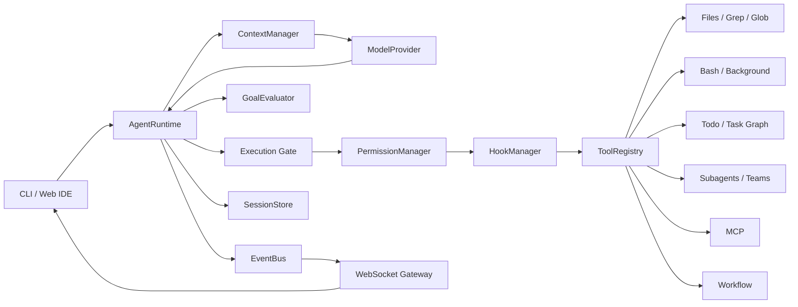

# Architecture

CodeAgent Studio keeps a small agent loop and attaches state, safety, orchestration, and observability as explicit runtime services.

## Runtime boundary



## Agent loop

The main loop owns conversation state and model turns. Tool growth does not require a new orchestration loop.

```text
messages
   │
   ▼
ModelProvider.complete
   │
   ├── text only ──► Stop / Goal decision ──► final
   │
   └── tool calls
           │
           ▼
       execution gate
           │
           ▼
       tool results
           │
           └────────► messages
```

The same runtime path is used by CLI and Web IDE sessions.

## Execution gate

`AgentRuntime.execute_tool()` is the authority for direct tool execution. It coordinates:

1. `PreToolUse` hooks
2. permission classification
3. optional human approval
4. `ToolRegistry` dispatch
5. `PostToolUse` hooks
6. event emission
7. normalized tool result

This prevents a workflow step or dynamically discovered MCP tool from becoming an accidental permission bypass.

## Provider abstraction

`ModelProvider` separates the harness from a specific model API. The repository includes:

- `AnthropicProvider` for live model sessions
- `ScriptedProvider` for deterministic tests and demo flows

A provider returns normalized text blocks and tool calls so the rest of the runtime is vendor-neutral.

## Context management

`ContextManager` assembles the current conversation and runtime context under a configurable budget. When the window grows, older content can be compacted while preserving recent tool results and task state.

The context layer is intentionally independent from repository retrieval. A future code-index or semantic-retrieval backend can be inserted without changing the agent loop.

## Persistence

Persistent state is stored under `.codeagent/`:

- sessions
- memory
- todo state
- task graph
- workflow journals

Workflow journals use stable run identifiers so completed steps can be reused during resume.

## Subagents and teams

A subagent receives an isolated message history and a constrained role. Team orchestration adds task claiming and mailbox-style communication. Git worktrees can isolate concurrent code changes so agents do not write into the same working tree.

## MCP

MCP servers are connected by the host. Discovered server tools are normalized into the local tool namespace:

```text
mcp__<server>__<tool>
```

Server descriptions and annotations never grant authority. Permission remains a host decision, and an unknown MCP tool defaults to confirmation.

## Goal-controlled completion

A worker model deciding to stop is not necessarily evidence that a task is complete. `GoalController` can invoke an independent, tool-free evaluator after a model turn. The evaluator reads the conversation evidence and returns one of:

- achieved
- continue
- impossible / failed

When the goal is not yet satisfied, control returns to the same agent loop instead of spawning a second orchestration system.

## Event stream

`EventBus` converts internal lifecycle transitions into ordered events. Representative event types include:

```text
user_prompt
model_start
model_end
tool_requested
permission
tool_start
tool_end
context_compacted
background_notifications
goal_decision
final
```

The FastAPI gateway subscribes to this stream and forwards events over WebSocket. The Web IDE Trace view therefore reflects real runtime state rather than simulated progress UI.

## Web boundary

The browser is a presentation and interaction layer. It does not own agent state.

```text
Browser
  ├── REST: workspace/file/diff/terminal metadata
  └── WebSocket: session commands + runtime events
                 │
                 ▼
             FastAPI
                 │
                 ▼
            AgentRuntime
```

This keeps CLI and Web behavior aligned and makes a future desktop shell or remote client possible without rewriting the harness.
